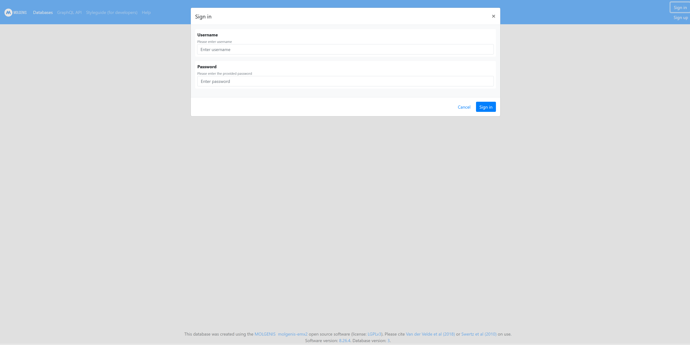
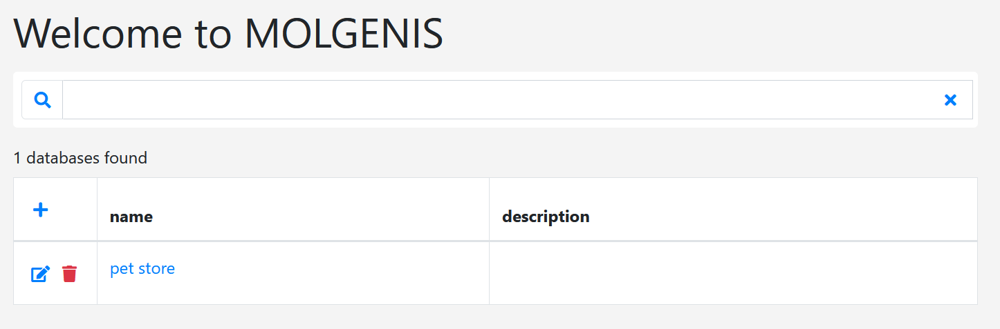
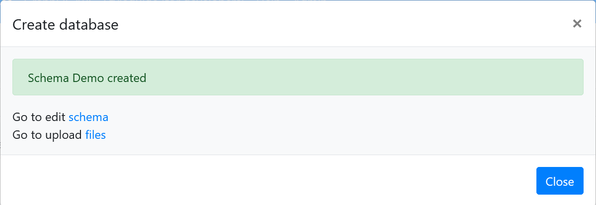
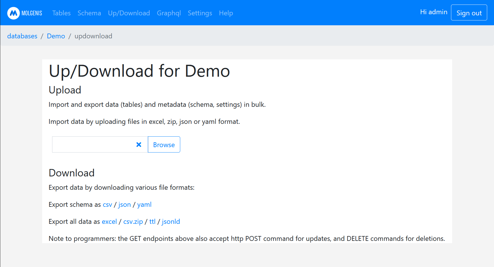
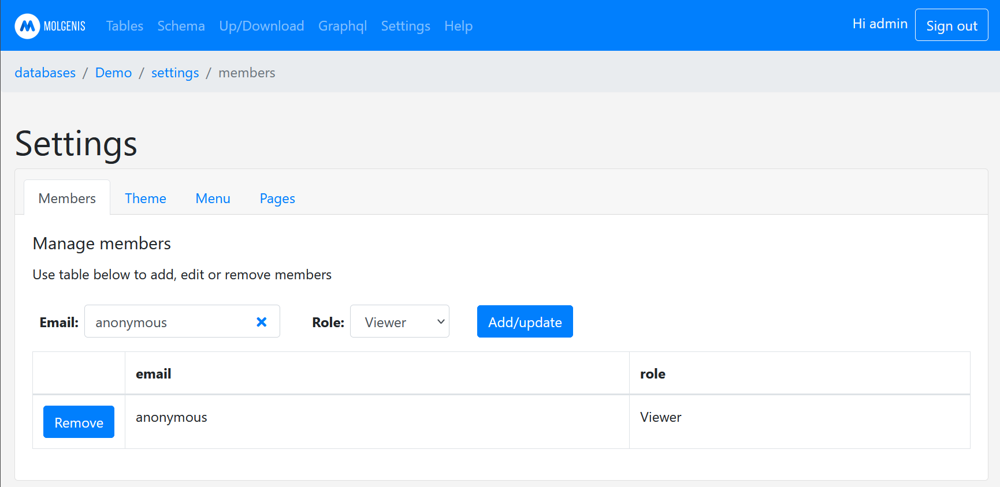

## Molgenis-EMX2 Installation Instructions 

### Start Molgenis-EMX2

Be patient this can take up to 5 minutes (its a huge app). The last message in the log files for molgenis-emxtwo and molgenis-emxtwo-postgres respectively should look something like this:

`2021-11-25_08:38:38.467 [Thread-1] INFO  org.eclipse.jetty.server.Server - Started @2907ms`

`2021-11-25 08:38:34.277 UTC [1] LOG:  database system is ready to accept connections`

### Log in with the default credentials. 
The default admin user has the following username/password: admin/admin.

### Start using the Molgenis-EMX2 app
Molgenis-EMX2 is organised into databases, which could be viewed as closed workspaces for your projects.
See https://molgenis.github.io/molgenis-emx2/#/molgenis/use

You can create a new database by clicking the plus symbol. 

#### Uploading a schema and data.
After you created a new database, you can directly jump to editing the schema in the web-editor or go to upload files and upload a schema and data. 
Supported formats are: csv, excel, zip, json or yaml.

#### Settings and User Management.
Settings are done per database. 
To add, edit or remove users from a database, use the database/Settings/Members tab. 
To make a database public (no login needed), add the anonymous user to the database.

### Further information on the Molgenis-EMX2 app.
Further information can be found here https://molgenis.github.io/molgenis-emx2/#/molgenis/use.
A demo-server can be found here https://emx2.test.molgenis.org/apps/central/#/.

## After the installation
Have a nice ride with the Admins youngtimer.

